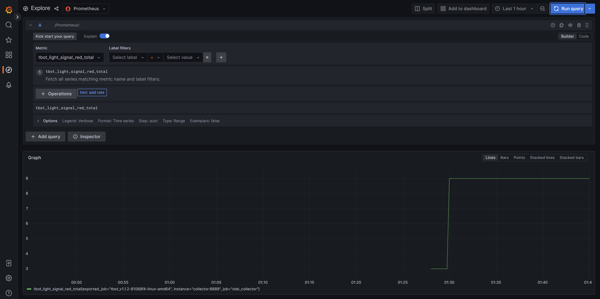

## flux-dev-monitoring

### At the stage of integration and testing yet

Monitoring on K8s cluster with Flux - OpenTelemetry + Prometheus + Fluentbit + Grafana + Loki

## 1 option
We can run the monitoring stack locally with application using docker-compose.
```bash
  --docker-compose -f otel/docker-compose.yaml up
```

## 2 option
We can convert our docker-compose to yaml files for deploying them in flux or with kubectl command
```bash
  --cd otel
  --kompose convert
```
Modificated result of such convertation we can see in folder cluster/demo.
Ready for deployming within flux.

## 3 option

Install following the official instructions - [Flux monitoring with Prometheus](https://fluxcd.io/flux/guides/monitoring/)

## Requirements

k8s
Flux

## Installation
To install the monitoring stack with flux, first register the Git repository on your cluster:

```bash
flux create source git flux-monitoring \
  --interval=30m \
  --url=https://github.com/EvgenPavlyuchek/flux-dev-monitoring \
  --branch=main
```

Install the Prometheus Stack:

```bash
flux create kustomization kube-prometheus-stack \
  --interval=1h \
  --prune \
  --source=flux-monitoring \
  --path="./monitoring/kube-prometheus-stack" \
  --health-check-timeout=5m \
  --wait
```

Install the Loki Stack + Fluent-bit:

```bash
flux create kustomization loki-stack \
  --depends-on=kube-prometheus-stack \
  --interval=1h \
  --prune \
  --source=flux-monitoring \
  --path="./monitoring/loki-stack" \
  --health-check-timeout=5m \
  --wait
```

Install Flux Grafana dashboards:

```bash
flux create kustomization monitoring-config \
  --depends-on=kube-prometheus-stack \
  --interval=1h \
  --prune=true \
  --source=flux-monitoring \
  --path="./monitoring/monitoring-config" \
  --health-check-timeout=1m \
  --wait
```

Install opentelemetry:

```bash
kubectl apply -f https://github.com/cert-manager/cert-manager/releases/download/v1.12.0/cert-manager.crds.yaml
or
helm repo add jetstack https://charts.jetstack.io && \
helm repo update && \
helm install \
  cert-manager jetstack/cert-manager \
  --namespace cert-manager \
  --create-namespace \
  --version v1.12.0 \
```

```bash
kubectl apply -f https://github.com/open-telemetry/opentelemetry-operator/releases/latest/download/opentelemetry-operator.yaml
```

```bash
flux create kustomization otel \
  --depends-on=kube-prometheus-stack \
  --interval=1h \
  --prune=true \
  --source=flux-monitoring \
  --path="./monitoring/otel" \
  --health-check-timeout=1m \
  --wait
```

## Grafana

```bash
kubectl -n monitoring port-forward svc/kube-prometheus-stack-grafana 3000:80

username: admin
password: prom-operator
```

